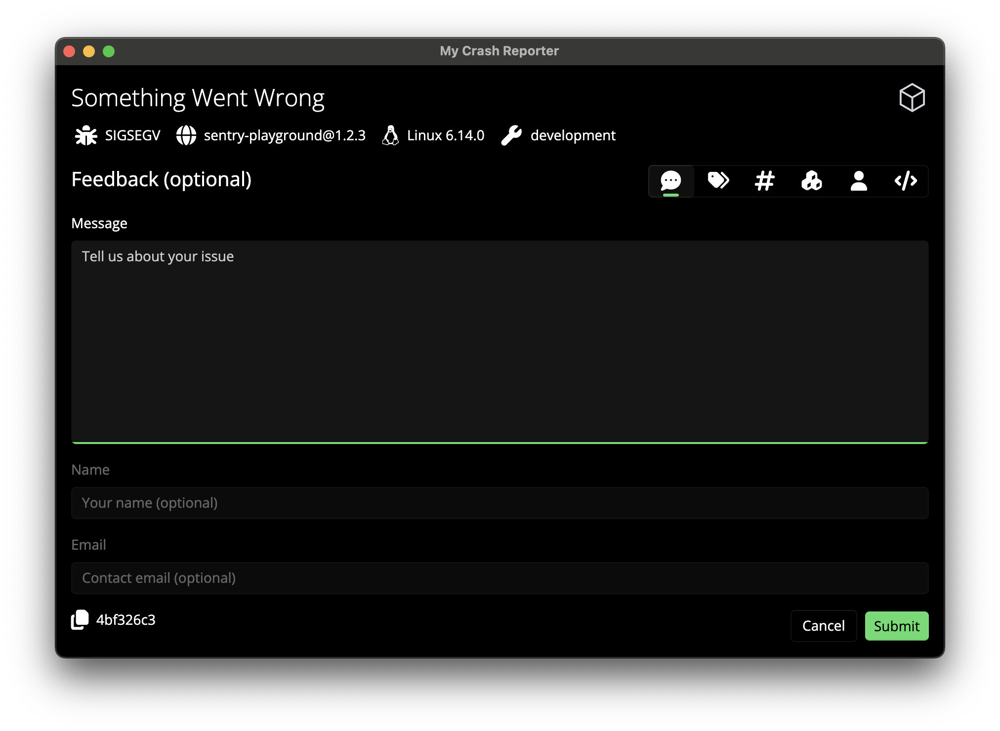

# Customization

This guide explains how to rebrand the crash reporter with your own logo, colors,
and window title.



## Logo / Icon

All paths below are relative to `Sentry.CrashReporter/`.

### Header logo

The header logo is displayed in the top-right corner of the main view
(`Views/HeaderView.cs:43-47`).

Replace the following files:

| File | Description |
|------|-------------|
| `Assets/AppLogo.light.png` | Light theme (1x) |
| `Assets/AppLogo.light.scale-200.png` | Light theme (2x) |
| `Assets/AppLogo.dark.png` | Dark theme (1x) |
| `Assets/AppLogo.dark.scale-200.png` | Dark theme (2x) |
| `Assets/AppLogo.png` | Fallback (1x) |
| `Assets/AppLogo.scale-200.png` | Fallback (2x) |

The theme-to-file mapping is defined in `Styles/Images.xaml` via the
`AppLogoIcon` resource key.

### Window / taskbar icon

Replace `Assets/Icons/icon.svg`. This is set in `App.xaml.cs:115` via
`SetWindowIcon()`.

### Multi-scale conventions

See `Assets/SharedAssets.md` for naming conventions and the scale-to-platform
mapping table (e.g. `scale-100` = iOS @1x, `scale-200` = iOS @2x / Android
xhdpi).

## Colors

All color resources are defined in `App.xaml` inside the `<ResourceDictionary>`.

### Accent color

The primary brand color used for buttons and highlights (`App.xaml:13-19`):

```xml
<Color x:Key="SystemAccentColor">#8866FF</Color>
<Color x:Key="SystemAccentColorLight1">#9C7FFF</Color>
<Color x:Key="SystemAccentColorLight2">#7554FF</Color>
<Color x:Key="SystemAccentColorLight3">#B08CFF</Color>
<Color x:Key="SystemAccentColorDark1">#7554FF</Color>
<Color x:Key="SystemAccentColorDark2">#5A3FCC</Color>
<Color x:Key="SystemAccentColorDark3">#3F2B99</Color>
```

Replace `#8866FF` with your brand color and adjust the Light/Dark variants
accordingly.

### Accent button foreground

The text color on accent-colored buttons (`App.xaml:22-25`):

```xml
<SolidColorBrush x:Key="AccentButtonForeground" Color="#FFFFFF" />
<SolidColorBrush x:Key="AccentButtonForegroundPointerOver" Color="#FFFFFF" />
<SolidColorBrush x:Key="AccentButtonForegroundPressed" Color="#FFFFFF" Opacity="0.9" />
<SolidColorBrush x:Key="AccentButtonForegroundDisabled" Color="#FFFFFF" Opacity="0.75" />
```

## Window Title & Header Text

Both are defined as string resources in `App.xaml`:

```xml
<x:String x:Key="WindowTitle">Sentry Crash Reporter</x:String>
<x:String x:Key="HeaderText">Report a Bug</x:String>
```

## Runtime Customization

Instead of editing source files and rebuilding, you can override the look-and-feel
at runtime by placing an `appsettings.json` file in one of the search locations.
Values in this file override the compiled-in defaults from `App.xaml`.

### Search order

The crash reporter looks for `appsettings.json` in the following locations (first
match wins):

1. The envelope's directory (e.g. `.sentry-native/external/`)
2. The envelope's parent directory (e.g. `.sentry-native/`)
3. The application directory (next to the binary)

This allows sentry-native integrations (e.g. sentry-unreal) to write per-project
settings into the sentry-native database directory.

### Example

```
.sentry-native/
├── appsettings.json
└── ...
```

```json
{
  "AppConfig": {
    "WindowTitle": "My Crash Reporter",
    "HeaderText": "Something Went Wrong",
    "LogoLight": "branding/logo-light.png",
    "LogoDark": "branding/logo-dark.png",
    "SystemAccentColor": "#4CAF50"
  }
}
```

### Supported keys

| Key | Description |
|-----|-------------|
| `WindowTitle` | Window title bar text. |
| `HeaderText` | Header text shown in the main view. |
| `LogoLight` | Path to a custom logo image for light theme (relative to the binary or absolute). |
| `LogoDark` | Path to a custom logo image for dark theme (relative to the binary or absolute). |
| `SystemAccentColor` | Primary brand color (`#RRGGBB` or `#AARRGGBB`). |
| `SystemAccentColorLight1` – `Light3` | Optional light variants. Auto-derived if omitted. |
| `SystemAccentColorDark1` – `Dark3` | Optional dark variants. Auto-derived if omitted. |
| `AccentButtonForeground` | Button text color. Auto-derived from contrast if omitted. |
