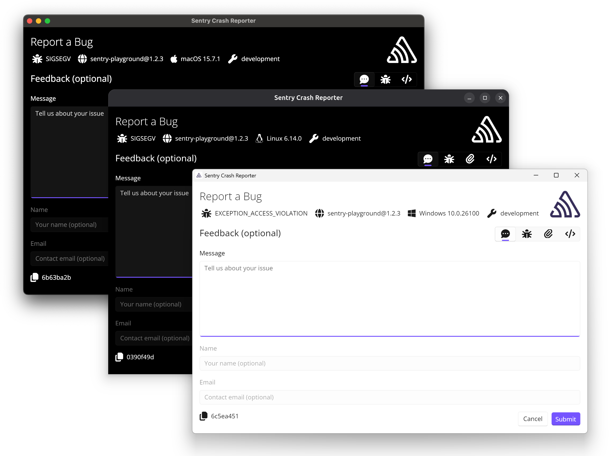

<p align="center">
  <a href="https://sentry.io/?utm_source=github&utm_medium=logo" target="_blank">
    <picture>
      <source srcset="https://sentry-brand.storage.googleapis.com/sentry-logo-white.png" media="(prefers-color-scheme: dark)" />
      <source srcset="https://sentry-brand.storage.googleapis.com/sentry-logo-black.png" media="(prefers-color-scheme: light), (prefers-color-scheme: no-preference)" />
      
    </picture>
  </a>
</p>

# Sentry Desktop Crash Reporter

[](https://github.com/getsentry/sentry-desktop-crash-reporter/actions/workflows/ci.yml)
[](https://codecov.io/gh/getsentry/sentry-desktop-crash-reporter)

A reference implementation of an external crash reporter for desktop applications using the [Sentry Native SDK](https://docs.sentry.io/platforms/native/).



## Features

* **User Consent:** Gives the user explicit control over whether their crash data is sent.
* **User Feedback:** Allows users to add comments to the crash report.
* **Crash Information:** Displays crash details from the minidump.
* **Cross-Platform:** Works on Windows, macOS, and Linux thanks to [.NET](https://dot.net) and the [Uno Platform](https://platform.uno/).

## Usage

```c
sentry_options_t *options = sentry_options_new();
sentry_options_set_external_crash_reporter_path(options, "/path/to/Sentry.CrashReporter");
/* ... */
sentry_init(options);
```
